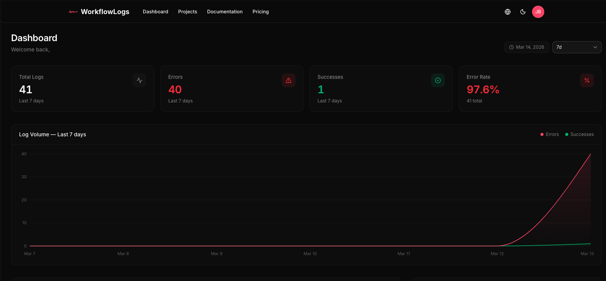
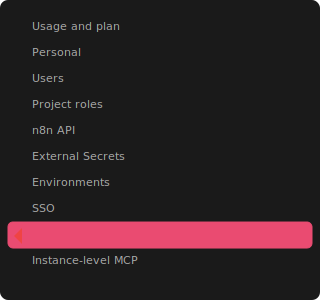
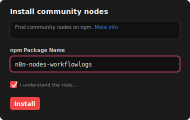
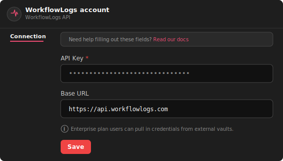
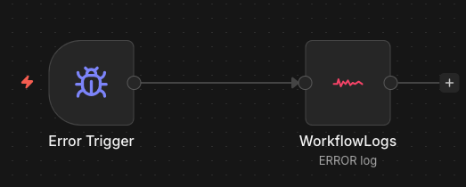

<p align="center">
  
</p>

<h1 align="center">n8n-nodes-workflowlogs</h1>

<p align="center">
  Stop silent workflow failures. Get real-time error monitoring for your n8n automations.
</p>

<p align="center">
  <a href="https://www.npmjs.com/package/n8n-nodes-workflowlogs"></a>
  <a href="https://www.npmjs.com/package/n8n-nodes-workflowlogs"></a>
  <a href="https://github.com/workflowlogs/n8n-nodes-workflowlogs/blob/main/LICENSE.md"></a>
  
</p>

<p align="center">
  <a href="https://workflowlogs.com">Website</a> &middot;
  <a href="https://workflowlogs.com/docs">Documentation</a> &middot;
  <a href="https://github.com/workflowlogs/n8n-nodes-workflowlogs/issues">Report Bug</a>
</p>

---

## The Problem

Your n8n workflows fail silently. An API changes, a credential expires, a timeout occurs — and nobody knows until a customer complains or data stops flowing. n8n has no centralized monitoring, no cross-workflow error dashboard, and no alerting.

**WorkflowLogs** fixes this with a single drag-and-drop node.

<p align="center">
  
</p>

## Features

- **Auto-Detect Mode** — Extracts error messages, stack traces, and node names from the Error Trigger automatically. Zero configuration.
- **Smart Error Grouping** — 30+ error patterns recognized (HTTP errors, timeouts, auth failures, DB errors, n8n-specific). Errors are fingerprinted to group duplicates.
- **Auto-Severity Detection** — Errors are classified as Critical, High, Medium, Low, or Info based on pattern matching.
- **Auto-Bound Metadata** — Workflow ID, name, execution ID, and execution URL are captured automatically from n8n context.
- **Payload Forwarding** — Optionally include the full input data for debugging.
- **Custom Metadata** — Attach arbitrary JSON to any log entry.

## Installation

### n8n Desktop / Self-hosted

1. Go to **Settings** > **Community Nodes**
2. Enter `n8n-nodes-workflowlogs`
3. Click **Install**

<p align="center">
  
  &nbsp;&nbsp;
  
</p>

### npm

```bash
cd ~/.n8n
npm install n8n-nodes-workflowlogs
```

Restart n8n after installation.

## Quick Start

### 1. Get your API key

Sign up at [workflowlogs.com](https://workflowlogs.com) (free tier — 1,000 logs/month, no credit card) and create a project.

### 2. Add credentials in n8n

Go to **Credentials** > **New** > **WorkflowLogs API** and paste your API key.

<p align="center">
  
</p>

### 3. Monitor errors

Connect the **Error Trigger** to the **WorkflowLogs** node:

```
[Error Trigger] → [WorkflowLogs]
```

That's it. Errors are detected, classified, and sent to your dashboard automatically.

<p align="center">
  
</p>

## Usage

### Auto-Detect Mode (recommended)

Works with the **Error Trigger** node. The node automatically extracts:

| Data | Source |
|------|--------|
| Error message | `execution.error.message` |
| Stack trace | `execution.error.stack` |
| Failed node name | `execution.lastNodeExecuted` |
| Workflow ID & name | n8n context (auto-bound) |
| Execution ID & URL | n8n context (auto-bound) |

### Manual Mode

For custom logging (success events, custom messages):

| Parameter | Type | Required | Description |
|-----------|------|----------|-------------|
| Log Type | `ERROR` / `SUCCESS` | Yes | Event type |
| Message | string | Yes | Log message (supports n8n expressions) |
| Error Code | string | No | e.g. `TIMEOUT`, `AUTH_FAILED` |
| Severity | select | No | Override auto-detected severity |
| Stack Trace | string | No | Full stack trace |
| Include Input Data | boolean | No | Attach input item as payload |
| Custom Metadata | JSON | No | Arbitrary JSON data |

### Common Patterns

**Error monitoring:**
```
[Error Trigger] → [WorkflowLogs (ERROR)]
```

**Success tracking:**
```
[Your Workflow] → [WorkflowLogs (SUCCESS)]
```

**Error + team notification:**
```
[Error Trigger] → [WorkflowLogs (ERROR)]
               → [Slack / Email]
```

## Templates

Import ready-made workflows from the [`templates/`](./templates/) directory:

| Template | Description |
|----------|-------------|
| `basic-error-monitoring.json` | Error Trigger → WorkflowLogs |
| `success-logging.json` | HTTP Trigger → Process → WorkflowLogs (SUCCESS) |
| `error-with-slack-notification.json` | Error Trigger → WorkflowLogs + Slack |

Import in n8n via **Workflows** > **Import from File**.

## Self-Hosting

Change the **Base URL** in credentials to your instance:

```
https://your-instance.example.com
```

## Development

```bash
git clone https://github.com/workflowlogs/n8n-nodes-workflowlogs.git
cd n8n-nodes-workflowlogs
npm install
npm run build
npm run dev   # watch mode
```

## License

[MIT](./LICENSE.md)

---

<p align="center">
  Built by <a href="https://workflowlogs.com">WorkflowLogs</a>
</p>
